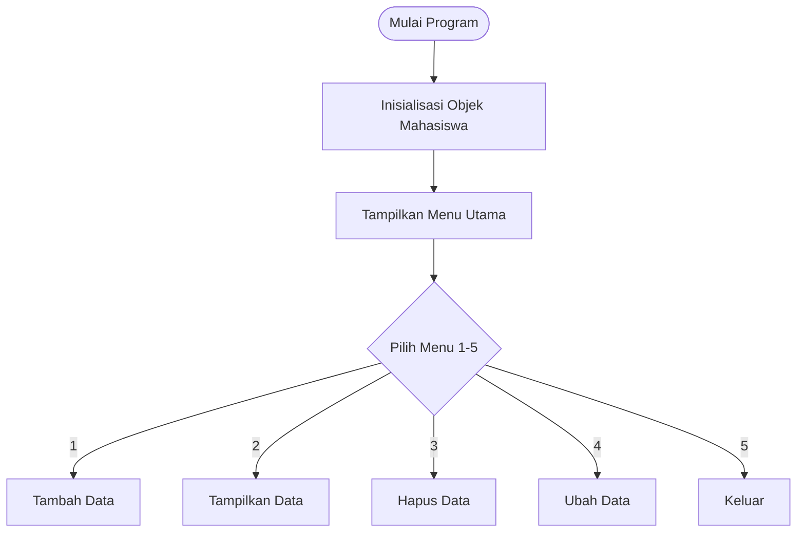

'' Sistem Manajemen Nilai Mahasiswa

Program Python sederhana untuk mengelola data nilai mahasiswa menggunakan konsep Object-Oriented Programming (OOP).

## Deskripsi Program

Program ini adalah sistem CRUD (Create, Read, Update, Delete) berbasis command-line untuk mengelola data nilai mahasiswa. Data disimpan dalam memori selama program berjalan dan menggunakan struktur class untuk organisasi kode yang lebih baik.

## Fitur Utama

1. **Tambah Data** - Menambahkan data mahasiswa baru (nama dan nilai)
2. **Tampilkan Data** - Menampilkan semua data mahasiswa dalam bentuk tabel
3. **Hapus Data** - Menghapus data mahasiswa berdasarkan nama
4. **Ubah Data** - Mengubah nilai mahasiswa berdasarkan nama
5. **Keluar** - Mengakhiri program

## Struktur Program

### Class Mahasiswa

```python
class Mahasiswa:
    - daftar_mahasiswa: list  # Menyimpan data mahasiswa
    
    + tambah()      # Menambah data baru
    + tampilkan()   # Menampilkan semua data
    + hapus(nama)   # Menghapus data berdasarkan nama
    + ubah(nama)    # Mengubah nilai berdasarkan nama
```

## Cara Penggunaan

1. Jalankan program:
```bash
python Lab7.py
```

2. Pilih menu yang tersedia (1-5)
3. Ikuti instruksi yang muncul di layar

## Contoh Penggunaan

```
========================================
SISTEM MANAJEMEN NILAI MAHASISWA
========================================
1. Tambah data mahasiswa
2. Tampilkan semua data
3. Hapus data mahasiswa
4. Ubah data mahasiswa
5. Keluar
========================================
Pilih menu (1-5): 1

=== Tambah Data Mahasiswa ===
Masukkan nama mahasiswa: John Doe
Masukkan nilai mahasiswa: 85.5
Data John Doe berhasil ditambahkan!
```

## Fitur Teknis

- **Error Handling**: Validasi input nilai (harus berupa angka)
- **Case Insensitive**: Pencarian nama tidak case-sensitive
- **Format Tabel**: Tampilan data terstruktur dengan alignment
- **OOP**: Menggunakan class untuk enkapsulasi data dan method

## Flowchart Program



## Persyaratan

- Python 3.x
- Tidak memerlukan library eksternal

## Catatan

- Data hanya tersimpan selama program berjalan (tidak persisten)
- Untuk penyimpanan permanen, pertimbangkan menggunakan database atau file

## Lisensi

Program ini dibuat untuk keperluan pembelajaran dan dapat digunakan secara bebas.
